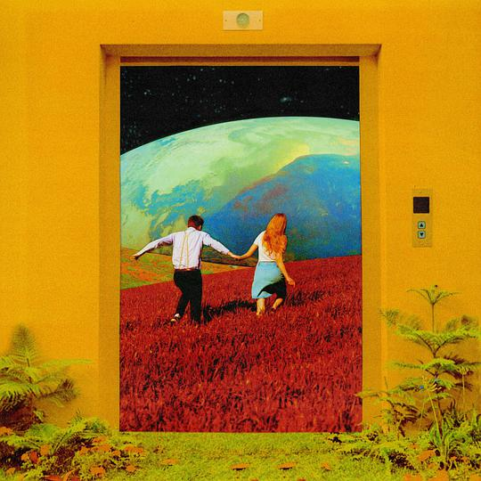

#  I'm Zhuzilv

- 🌑  I am currently working in GrowingIO.
- 🌒  I'm learning English, Computer principles,  algorithms and front-end.
- 🌓  When you see this news, maybe I'm still working overtime.
- 🌖  I expect to study abroad in the next three years
- 🌕  You can invite me to translate some open source projects.
- ✉️  vermilionAnd@163.com  /  vermilionAnd@gmail.com
  

<!--  -->
<!--  -->

 

  
  
  
  
  
  
    
